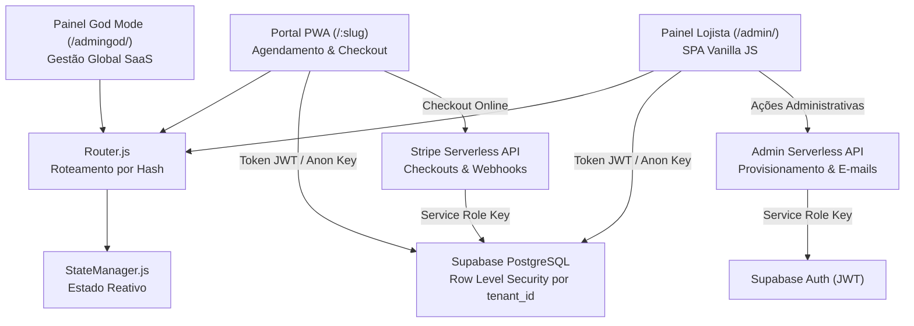

<div align="center">
  
  <h1>VitrineDesk</h1>
  <p><strong>Plataforma SaaS Multi-Tenant All-in-One de Gestão Operacional, Autoagendamento PWA, PDV e CRM para Negócios de Serviços e Beleza.</strong></p>

  <p>
    <a href="https://github.com/Richardlds/VitrineDesk"></a>
    
    
    
    
    <a href="LICENSE"></a>
  </p>

  <p>
    <a href="#como-executar-o-projeto-localmente">Executar Localmente</a> ·
    <a href="#decisões-de-arquitetura-e-engenharia">Arquitetura</a> ·
    <a href="#visão-de-negócio-e-problema-resolvido">Visão de Negócio</a> ·
    <a href="#autor-e-contato">Contato</a>
  </p>
</div>

---

## Sumário

- [Visão de Negócio e Problema Resolvido](#visão-de-negócio-e-problema-resolvido)
- [Decisões de Arquitetura e Engenharia](#decisões-de-arquitetura-e-engenharia)
- [Stack Tecnológica](#stack-tecnológica)
- [Como Executar o Projeto Localmente](#como-executar-o-projeto-localmente)
- [Estrutura de Pastas](#estrutura-de-pastas)
- [Autor e Contato](#autor-e-contato)
- [Licença](#licença)

---

## Visão de Negócio e Problema Resolvido

No mercado de beleza e serviços (salões, barbearias, clínicas e estúdios), a gestão tradicional depende de mensagens manuais no WhatsApp, anotações em papel e planilhas desconexas. Esse cenário gera **perda de agendamentos por demora no atendimento**, **altas taxas de no-show (faltas sem aviso)**, **divergências no cálculo de comissões de parceiros** e **descontrole financeiro e de estoque**.

O **VitrineDesk** centraliza e digitaliza toda a jornada operacional em uma única plataforma:

### Funcionalidades Centrais

- **Portal do Cliente (PWA Instalável):** Agendamento autônomo 24/7 via link dedicado (`/:slug`), com seleção de profissional, horários em tempo real, catálogo de serviços e checkout online, sem necessidade de download em app stores.
- **Agenda Inteligente:** Gestão diária e mensal com prevenção nativa de choque de horários e cálculo dinâmico de intervalos.
- **Frente de Caixa (PDV) e Ordens de Serviço (OS):** Registro de atendimentos, múltiplos métodos de pagamento (cartão, dinheiro, PIX), controle de caixa e conciliação financeira.
- **Comissionamento Automático:** Cálculo automático de repasse por profissional e serviço, eliminando fechamentos manuais.
- **Controle de Estoque:** Gestão de produtos de uso interno e venda direta no balcão integrada ao PDV, com alerta de estoque mínimo.
- **CRM, Fidelidade e Planos:** Histórico de consumo, planos de assinatura recorrente para clientes, cupons de desconto e blacklist preventiva de no-shows.
- **Multi-Filiais e RBAC:** Controle centralizado de múltiplas unidades com perfis de acesso (Administrador, Gerente, Profissional, Atendente).
- **Painel Master (God Mode):** Gestão global de tenants (lojistas), planos da plataforma, métricas SaaS (MRR/ARR) e suporte.

---

## Decisões de Arquitetura e Engenharia



### 1. SPA Vanilla JS com ES6 Modules (Zero Build Step)
- **Motivação:** Máxima performance de execução, sem complexidade de bundlers ou tempos de build.
- **Carregamento Dinâmico:** O `Router.js` intercepta rotas por hash (`#/categoria/tela`), busca o fragmento HTML da view e importa assincronamente o Controller correspondente sob demanda.
- **Gerenciamento de Recursos:** Cada Controller possui método `destroy()` para remoção de event listeners e prevenção de vazamentos de memória.

### 2. Isolamento Multi-Tenant via Row Level Security (RLS)
- **Segurança em Nível de Banco:** O isolamento entre organizações é garantido pelo PostgreSQL no Supabase. Cada query é validada com base no `tenant_id` atrelado ao token JWT do usuário autenticado.

### 3. Separação de Privilégios (Frontend vs Backend)
- **Chaves Públicas:** O cliente acessa apenas com a chave anônima pública (`anon key`), limitada pelas políticas RLS.
- **Ações Críticas Isoladas:** Operações sensíveis (provisionamento de acessos, cobranças e webhooks Stripe) executam em Serverless Functions ([`/api`](file:///c:/Users/richard.santo/Documents/GitHub/VitrineDesk/api)) utilizando a chave privada (`service_role key`).

### 4. Design System Nativo
- **Consistência Visual:** Interface Dark Mode com Glassmorphism estruturada em classes utilitárias proprietárias (`design-system.css`) e ícones Lucide sob demanda.

---

## Stack Tecnológica

| Camada | Tecnologias |
| :--- | :--- |
| **Frontend** | Vanilla JavaScript (ES6+), HTML5 Semântico, CSS3 Moderno (Custom Properties e Glassmorphism) |
| **Arquitetura** | SPA com Router nativo, StateManager reativo e carregamento dinâmico de Controllers |
| **PWA & Offline** | Service Workers (`sw.js`), Web App Manifest |
| **Backend & Banco** | Supabase (PostgreSQL 15+, Row Level Security, Auth JWT, Edge Functions) |
| **Pagamentos** | Stripe API (Checkout Sessions, Assinaturas e Webhooks) |
| **E-mails** | Resend API (Notificações e boas-vindas transacionais) |
| **Bibliotecas UI** | Lucide Icons, FullCalendar, Swiper.js |
| **DevOps & Deploy** | Vercel (Static & Serverless Functions), ESLint, GitHub Actions CI |

---

## Como Executar o Projeto Localmente

### Pré-requisitos
- **Node.js** `>= 18.x`
- **npm** (incluso com o Node.js)
- Conta no [Supabase](https://supabase.com/) com schema e RLS configurados

### Passo a Passo

1. **Clonar o Repositório:**
   ```bash
   git clone https://github.com/Richardlds/VitrineDesk.git
   cd VitrineDesk
   ```

2. **Instalar Dependências:**
   ```bash
   npm install
   ```

3. **Configurar Variáveis de Ambiente:**
   ```bash
   cp .env.example .env
   ```
   Preencha o `.env` com suas credenciais do Supabase e Stripe:
   ```env
   SUPABASE_URL=https://seu-projeto.supabase.co
   SUPABASE_ANON_KEY=sua-chave-anon-publica
   SUPABASE_SERVICE_ROLE_KEY=sua-chave-service-role-privada
   STRIPE_SECRET_KEY=sk_test_...
   STRIPE_WEBHOOK_SECRET=whsec_...
   ```

4. **Validar Código com ESLint:**
   ```bash
   npm run lint
   ```

5. **Iniciar o Servidor:**
   ```bash
   # Opção A: Servidor estático leve
   npm run serve

   # Opção B: Ambiente completo com Serverless Functions (/api)
   npm run start-dev
   ```

6. **Rotas de Acesso:**
   - **Landing Page:** `http://localhost:3000/`
   - **Painel do Lojista:** `http://localhost:3000/admin/`
   - **Portal do Cliente (PWA):** `http://localhost:3000/cliente/?tenant=demo`
   - **God Mode (Master Admin):** `http://localhost:3000/admingod/`

---

## Estrutura de Pastas

```text
VitrineDesk/
├── .github/                 # Workflows de CI, Issue Forms e PR Template
├── admin/                   # Painel Administrativo do Lojista (SPA)
│   ├── js/controllers/      # Controladores por módulo (Agenda, PDV, Estoque, etc.)
│   ├── js/core/             # Router.js, StateManager.js, supabaseClient.js
│   └── views/               # Fragmentos HTML carregados dinamicamente
├── admingod/                # Painel Master / Super Admin do SaaS
├── api/                     # Serverless Functions (Stripe, Admin, E-mails)
├── cliente/                 # Portal PWA de Agendamento do Cliente Final
├── css/                     # Design System Nativo (design-system.css)
├── js/                      # Módulos compartilhados (auth, config, utils)
├── supabase/                # Migrações SQL e Edge Functions
├── .env.example             # Modelo documentado de variáveis de ambiente
├── CONTRIBUTING.md          # Diretrizes de contribuição
└── package.json             # Dependências e scripts
```

---

## Autor e Contato

Desenvolvido por **Richard Santo** — Engenheiro de Software focado em arquiteturas escaláveis, sistemas SaaS e interfaces modernas.

- **GitHub:** [@Richardlds](https://github.com/Richardlds)
- **E-mail:** [richardlds@hotmail.com](mailto:richardlds@hotmail.com)

---

## Licença

Distribuído sob a licença **MIT**. Consulte [`LICENSE`](LICENSE) para mais detalhes.
